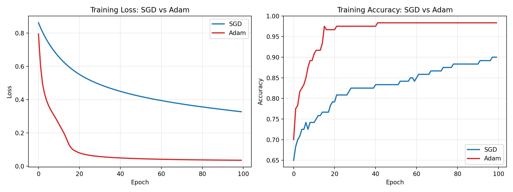

# Optimizer-Comparison-Using-a-Neural-Network
Comparing SGD and Adam optimizers on a simple neural network trained on the Iris dataset using TensorFlow/Keras, with training curves and classification reports.

# Project 9: Optimizer Comparison Using a Neural Network

A simple neural network trained on the Iris dataset with two different optimizers, **SGD** and **Adam**, to compare training behavior and classification performance.

## Overview

Both models share the same architecture, the same starting weights (fixed seed), and the same training settings, so any difference in results comes from the optimizer alone.

**Network:** 4 inputs → 8 hidden neurons (ReLU) → 3 outputs (Softmax)

| Setting | Value |
|---|---|
| Learning rate | 0.01 |
| Batch size | 16 |
| Epochs | 100 |
| Loss | Sparse categorical cross-entropy |
| Train/test split | 80/20 (stratified) |

## Results

| Optimizer | Train Loss | Train Acc | Test Loss | Test Acc |
|---|---|---|---|---|
| SGD | 0.3268 | 90.00% | 0.3727 | 80.00% |
| Adam | 0.0352 | 98.33% | 0.0709 | 96.67% |

- Adam's training loss dropped below 0.30 by epoch 9. SGD never reached it in 100 epochs.
- Both classified Setosa perfectly. SGD struggled with Versicolor and Virginica, which overlap in feature space.
- SGD was still improving at epoch 100, so it's slower here, not incapable. More epochs, a higher learning rate, or momentum would help it catch up.



> Note: the test set is only 30 samples and this is a single run, so exact accuracy numbers may vary with a different seed or split. The overall trend (Adam converges faster) is the key takeaway.

## Tech Stack

- Python
- TensorFlow / Keras
- scikit-learn
- NumPy
- Matplotlib

## How to Run

```bash
pip install tensorflow scikit-learn numpy matplotlib
python optimizer_comparison.py
```

This trains both models, prints the comparison table and classification reports, and saves `optimizer_comparison.png`.

## Files

- `optimizer_comparison.py`: full code (data prep, training, evaluation, plots)
- `optimizer_comparison.png`: loss and accuracy curves for SGD vs Adam
- `README.md`: project documentation

## Author

Poojashree
